# 📊 Data Analyst Portfolio: Practical Data Analytics & Insights

[](https://python.org)
[](https://pandas.pydata.org)
[](https://numpy.org)
[](https://seaborn.pydata.org)
[]()

> *"Raw numbers don't make business decisions; structured insights, root-cause diagnostics, and strategic recommendations do."*

This repository houses **4 comprehensive, publication-grade analytical case studies** designed to demonstrate practical, end-to-end capabilities in **Data Analysis & Business Intelligence**. Spanning retail consumer behavior, production data engineering pipelines, multinational profitability audits, and executive C-suite KPI dashboards, each notebook models how an experienced practitioner approaches real-world business challenges.

---

## 🏛️ Portfolio Architecture & Case Studies

| Project | Flagship Notebook | Domain | Key Methodologies & Techniques | Core Business Impact |
| :--- | :--- | :--- | :--- | :--- |
| **01** | [`01_Customer_Behavior_and_Demographic_Analysis.ipynb`](file:///home/himel-debnath/personal%20drive/Projects/Datasets_CSV/01_Customer_Behavior_and_Demographic_Analysis.ipynb) | Retail E-Commerce | Demographic slicing, Welch's t-test, Tukey's IQR fences, percentile distribution, price elasticity. | Uncovered that 25% of VIP Gold buyers drive 43.1% of revenue; identified customer dissatisfaction risks in high-ticket categories. |
| **02** | [`02_Data_Cleaning_and_Feature_Engineering_Pipeline.ipynb`](file:///home/himel-debnath/personal%20drive/Projects/Datasets_CSV/02_Data_Cleaning_and_Feature_Engineering_Pipeline.ipynb) | Data Engineering & ML Prep | Missingness matrix diagnostics (MCAR/MAR), conditional group imputation, 1%/99% Winsorization, Log1p, Scratch MinMax & Z-Score, drop-first One-Hot. | Prevented a 98.7% data loss disaster from naive `dropna()`; delivered a 100% numeric, certified modeling-grade feature matrix. |
| **03** | [`03_Global_Superstore_Profitability_and_Commercial_Audit.ipynb`](file:///home/himel-debnath/personal%20drive/Projects/Datasets_CSV/03_Global_Superstore_Profitability_and_Commercial_Audit.ipynb) | Corporate Finance & P&L | International datetime rectification, margin diagnostics, discount cannibalization curves, Pareto 80/20, geographic loss centers. | Diagnosed a **$920k cumulative financial loss** across 24.5% of orders; pinpointed the exact **20% discount cliff** and systemic deficits in Tables (-$64k). |
| **04** | [`04_Customer_Lifecycle_RFM_Cohorts_and_Executive_Dashboard.ipynb`](file:///home/himel-debnath/personal%20drive/Projects/Datasets_CSV/04_Customer_Lifecycle_RFM_Cohorts_and_Executive_Dashboard.ipynb) | Customer Lifecycle & Ops | RFM segmentation, 48-month triangular cohort retention heatmap, carrier SLA fulfillment audit, market basket co-occurrence mining, 4-panel executive dashboard. | Flagged 205 "At-Risk" enterprise accounts ($3.73M at stake); uncovered a severe 39% SLA breach rate in First Class express delivery. |

---

## 🔍 Deep Dive: Case Study Highlights

```mermaid
flowchart TD
    subgraph Track1 ["Case Study 01: Retail Demographics"]
        A1["Raw Ingestion & 0-Null Check"] --> B1["Demographic Slicing & Welch's T-Test"]
        B1 --> C1["Gold/Silver/Bronze Tiers & VIP Retention"]
    end

    subgraph Track2 ["Case Study 02: Pipeline Engineering"]
        A2["Severe Missingness (98.7% Drop Trap)"] --> B2["Skew-Aware & Group Imputation"]
        B2 --> C2["1%/99% Winsorization + Scratch Scaling"]
    end

    subgraph Track3 ["Case Study 03: Commercial Profitability"]
        A3["$12.64M GMV Commercial Ingestion"] --> B3["The 20% Discount Cliff"]
        B3 --> C3["$920k Loss Elimination & Category Turnaround"]
    end

    subgraph Track4 ["Case Study 04: Executive Lifecycle"]
        A4["RFM Client Segmentation"] --> B4["Triangular Cohort Retention Heatmap"]
        B4 --> C4["39% First-Class SLA Breach Alert & Cross-Sell"]
    end
```



---

### Case Study 01: Customer Behavior & Demographic Analysis
* **Problem**: A South Asian regional retail enterprise needed to understand customer acquisition and spending elasticity across 6 countries (Pakistan, Sri Lanka, Bangladesh, Nepal, India, Afghanistan).
* **Key Findings**:
  - **Spending Parity Across Days**: Customers signing up on weekends spend an average of $9,862 vs. $9,936 for weekday signups. Welch's two-sample t-test ($p = 0.89$) confirmed zero spend elasticity by registration day, advising marketing to normalize ad spend evenly across the week.
  - **The Gold Tier Advantage**: The top 25% of spenders (orders >$14,472) account for **$2.14M (43.1%)** of total revenue.
  - **Dissatisfaction in High-Ticket Items**: Multiple top spenders in Furniture and Toys reported satisfaction ratings <2.0, identifying immediate VIP churn risks.

---

### Case Study 02: Production Data Hygiene & Feature Pipeline
* **Problem**: Ingesting messy telemetry logs where missing values, skewed sensor measurements, and extreme outliers make raw data unsuitable for machine learning models.
* **Key Findings**:
  - **The Complete-Case Deletion Trap**: Only 64 rows (1.28%) out of 5,000 were completely non-null. Naively dropping missing rows (`df.dropna()`) would wipe out **98.72%** of the dataset!
  - **Principled Imputation**: Applied median imputation to skewed continuous attributes (`Feature5`: skew 2.60) and mean imputation to symmetric attributes. Categoricals with >30% missingness (`Feature4`, `Feature20`) had missingness encoded as an informative `'Missing'` state.
  - **Winsorization Over Row Deletion**: Capped heavy tails at the 1st and 99th percentiles via `np.clip()`, neutralizing extreme leverage points without losing a single training observation.
  - **Mathematical Scratch Scaling**: Built vectorized Min-Max Normalization and Z-Score Standardization from scratch, numerically verifying $\mu \approx 0.000$ and $\sigma^2 \approx 1.000$.

---

### Case Study 03: Global Commercial Profitability Audit
* **Problem**: Global Superstore fulfilled 51,290 transactions across 147 countries, generating $12.64M in sales, but corporate profits were compressing.
* **Key Findings**:
  - **The $920,357 Leakage**: 12,543 orders (24.46% of all transactions) operated at a net financial loss, dragging down corporate profit from potential $2.39M to $1.47M.
  - **The 20% Discount Cliff**: Orders with 0% discount average **+$61.04 profit** (26.5% margin). Profitability remains positive up to a 20% discount. Above 20%, margins collapse into severe deficits (-$55 to -$97 per order).
  - **Unprofitable Product Lines**: The **Tables** sub-category generated $758k in revenue but lost **-$64,083** due to freight bulk and an average discount of 28.9%.
  - **Acute Geographic Drain**: Turkey (-$98.4k), Nigeria (-$80.8k), Netherlands (-$41.1k), Honduras (-$29.5k), and Pakistan (-$22.4k) together drained **-$272,246** in cumulative profit.

---

### Case Study 04: Customer Lifecycle, RFM Cohorts & Executive KPI Dashboard
* **Problem**: C-suite leadership required a unified executive lens into client account retention, carrier logistics SLA compliance, and cross-selling synergies.
* **Key Findings**:
  - **RFM Account Segmentation**: Segmented 795 enterprise accounts into 5 tiers. **Champions** (200 clients, 25.2%) contribute **$4.42M (35.0%)** of total revenue. **205 clients ($3.73M in revenue)** were flagged in the **At-Risk** quadrant, requiring urgent win-back workflows.
  - **Cohort Reorder Dynamics**: 12-month average cohort retention stabilized at **32.4%**, with pronounced Q4 procurement spikes each year.
  - **Logistics SLA Failure**: Overall SLA breach rate was 16.1%. Crucially, **First Class express shipping breached its promised 2-day SLA on 39.0% of orders**, failing premium paying clients.
  - **Market Basket Affinities**: 51.0% of orders were multi-item transactions. Top co-purchasing bundles include **Binders + Storage** (944 orders) and **Art + Binders** (895 orders), enabling high-converting checkout recommendations.

---

## 🛠️ Tech Stack & Analytical Standards

* **Data Manipulation**: `pandas`, `numpy` (vectorized math, boolean masks, query expressions)
* **Statistical Analysis**: `scipy.stats` (Welch's t-test, Fisher-Pearson skewness, kurtosis, Tukey's fences)
* **Visual Storytelling**: `matplotlib`, `seaborn` (custom palettes, despined axes, formatted currency/percent tickers, direct bar labels)
* **Design Principles**: High data-to-ink ratio (Edward Tufte guidelines), accessible color choices, explicit annotations, and executive markdown summaries for every chart.

---

## 🚀 Running the Notebooks Locally

1. **Clone the repository**:
   ```bash
   git clone https://github.com/<your-username>/Datasets_CSV.git
   cd Datasets_CSV
   ```

2. **Create a virtual environment & install requirements**:
   ```bash
   python -m venv venv
   source venv/bin/activate
   pip install pandas numpy matplotlib seaborn scipy jupyter nbconvert
   ```

3. **Launch Jupyter Lab or Notebook**:
   ```bash
   jupyter lab
   ```

All notebooks are **fully pre-executed**, meaning you can inspect all rendered visualizations, tables, and metrics directly on GitHub without re-running.
