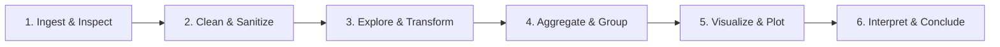

# 🚀 Data Analysis Mastery: Practical Project-Driven Roadmap

> **"I saw many tutorials, but I don't know from scratch how to do it. The best way to learn is to build projects."**
> — You are 100% right. Watching someone else type `df.groupby()` creates an illusion of competence. Real learning happens when you face a raw dataset, formulate questions, get stuck on errors, and write the code yourself to uncover insights.

---

## 🧭 The Learning Architecture

This repository contains **4 CSV datasets** spanning different real-world challenges:
1. **`Dataset_01.csv`**: Customer Demographics & Purchases (Clean, small, ideal for fundamentals).
2. **`Dataset_02.csv`**: Messy 20-Feature Machine Learning Data (Missing values, outliers, transformations).
3. **`Dataset_03.csv`**: Global Superstore Sales (51k+ rows, time series, multi-level business EDA).
4. **`Dataset_04.csv`**: Advanced Analytics & KPI Dashboard (RFM segmentation, cohort retention, supply chain).

```
DATA_ANALYSIS/
├── Dataset_01.csv
├── Dataset_02.csv
├── Dataset_03.csv
├── Dataset_04.csv
└── practice/
    ├── README.md                                          <-- You are here
    ├── 01_Dataset_01_Customer_Purchases.md               <-- Beginner to Intermediate EDA
    ├── 02_Dataset_02_Data_Cleaning_And_Feature_Engineering.md <-- Wrangling & Preprocessing
    ├── 03_Dataset_03_Global_Superstore_EDA.md             <-- Business Analytics & Insights
    ├── 04_Dataset_04_Advanced_Analytics_And_KPI_Dashboard.md <-- Cohorts, RFM & Dashboards
    └── 05_Tips_Tricks_And_Curated_Datasets.md             <-- Pro Tips & 10 Downloadable Datasets
```

---

## 🧠 The 4 Pillars of the Python Data Stack

To work from scratch, keep this mental model in mind:

| Tool | Core Role | What to use it for |
| :--- | :--- | :--- |
| **NumPy (`np`)** | Fast Array Computing & Math | Vectorized arithmetic, percentiles, standard deviation, array slicing, conditional logic (`np.where`, `np.select`), handling `np.nan`. |
| **Pandas (`pd`)** | Tabular Data Structuring & Wrangling | Reading CSVs, boolean filtering, string/datetime methods, handling missing values, `groupby`, `agg`, `pivot_table`, `merge`, `melt`. |
| **Matplotlib (`plt`)** | Canvas & Low-Level Plotting Engine | Creating figure/axes (`plt.subplots()`), canvas sizing, custom labels, legends, tick formatting, annotations, multi-plot layouts. |
| **Seaborn (`sns`)** | High-Level Statistical Visuals | Beautiful themes, distribution plots (`histplot`, `kdeplot`), relationships (`scatterplot`, `lineplot`), categories (`boxplot`, `barplot`, `countplot`), matrices (`heatmap`). |

---

## 🛠️ The 6-Step Universal Data Analysis Workflow

Whenever you open a new CSV dataset, follow these exact 6 steps sequentially:



1. **Ingest & Inspect**:
   - `df = pd.read_csv('...')`
   - `df.shape`, `df.info()`, `df.head(5)`, `df.describe()`, `df.nunique()`
   - *Goal*: Know the shape, column datatypes, and initial anomalies.
2. **Clean & Sanitize**:
   - Check missing values: `df.isnull().sum()`
   - Fix column datatypes (e.g., strings to float, strings to datetime).
   - Handle duplicates: `df.duplicated().sum()`.
3. **Explore & Transform (NumPy + Pandas)**:
   - Create derived metrics (e.g., `profit_margin = profit / sales`).
   - Vectorized categorization using `np.where()` or `pd.cut()`.
   - Filter rows based on business logic.
4. **Aggregate & Group**:
   - Multi-dimensional summary using `df.groupby(['cat1', 'cat2'])['metric'].agg(['mean', 'median', 'count'])`.
   - Pivot tables for matrix views.
5. **Visualize (Matplotlib + Seaborn)**:
   - Univariate (1 variable): Histograms, countplots, boxplots.
   - Bivariate (2 variables): Scatter plots, line charts, bar charts.
   - Multivariate (3+ variables): Scatter with `hue`/`size`, heatmaps, FacetGrids.
6. **Interpret & Conclude**:
   - Write 2-3 sentences explaining *what the numbers mean* for decision making.

---

## 💡 Practical Advice: How to Practice Without Getting Stuck

1. **Create one Jupyter notebook per dataset**:
   - `notebook_01_practice.ipynb` for `Dataset_01.csv`
   - `notebook_02_practice.ipynb` for `Dataset_02.csv`
   - `notebook_03_practice.ipynb` for `Dataset_03.csv`
   - `notebook_04_practice.ipynb` for `Dataset_04.csv`
2. **Do NOT look up entire solutions**:
   - If you forget syntax, look up the specific function documentation (e.g., `df.groupby documentation` or `sns.barplot parameters`), not "how to solve question 3".
3. **Always use the Object-Oriented (OO) Matplotlib syntax**:
   ```python
   # Recommended modern standard:
   fig, ax = plt.subplots(figsize=(10, 6))
   sns.barplot(data=df, x='category', y='sales', ax=ax)
   ax.set_title("Total Sales by Category", fontsize=14, weight='bold')
   plt.tight_layout()
   plt.show()
   ```
4. **Never ignore Warnings**:
   - `SettingWithCopyWarning`? That means you chained indexers instead of using `.loc[row_indexer, col_indexer] = value` or `.copy()`.
5. **Formulate a hypothesis before running a query**:
   - Example: *"I hypothesize older customers spend more on Furniture."*
   - Then calculate the numbers and plot the data to verify or disprove your hypothesis.

---

## 📋 Recommended Practice Order

| Order | Practice Guide | Key Focus Areas |
| :---: | :--- | :--- |
| **Step 1** | [01_Dataset_01_Customer_Purchases.md](file:///mnt/UBUNTU_DATA/Coding/DATA_ANALYSIS/practice/01_Dataset_01_Customer_Purchases.md) | Fundamentals of Pandas, NumPy math, basic plots, demographic analysis. |
| **Step 2** | [02_Dataset_02_Data_Cleaning_And_Feature_Engineering.md](file:///mnt/UBUNTU_DATA/Coding/DATA_ANALYSIS/practice/02_Dataset_02_Data_Cleaning_And_Feature_Engineering.md) | Handling NaNs, IQR outliers, log transforms, one-hot encoding, correlation heatmaps. |
| **Step 3** | [03_Dataset_03_Global_Superstore_EDA.md](file:///mnt/UBUNTU_DATA/Coding/DATA_ANALYSIS/practice/03_Dataset_03_Global_Superstore_EDA.md) | Real-world business EDA, string cleaning, dates, multi-level aggregations, profit/loss audit. |
| **Step 4** | [04_Dataset_04_Advanced_Analytics_And_KPI_Dashboard.md](file:///mnt/UBUNTU_DATA/Coding/DATA_ANALYSIS/practice/04_Dataset_04_Advanced_Analytics_And_KPI_Dashboard.md) | RFM customer segmentation, cohort retention matrices, multi-plot KPI dashboard. |
| **Step 5** | [05_Tips_Tricks_And_Curated_Datasets.md](file:///mnt/UBUNTU_DATA/Coding/DATA_ANALYSIS/practice/05_Tips_Tricks_And_Curated_Datasets.md) | Pro tips & tricks (memory, `.query()`, `np.select`, Seaborn polish) + 10 curated datasets. |
